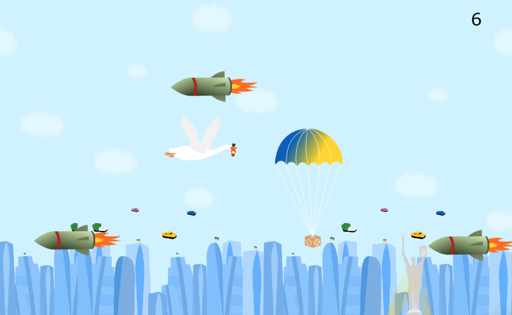

# Goose Game in Python

Simple game about catching bonuses and avoiding rockets.

## Installation

I am using [Poetry](https://python-poetry.org/) for dependency management, so make sure you have Poetry installed.
In terminal navigate to the project root and run `poetry install`.

## Running

In terminal navigate to the project root and run `poetry run python main.py`.

## Attribution

This project was created in scope of a mini-marathon course by [GoIT programming school](https://goit.global/ph/).
